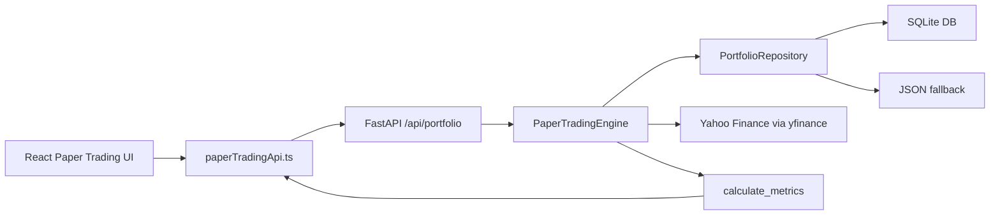

# Capital Scope Behavioral Lab — Inherited Architecture

> This document describes the architecture inherited from Capital Scope Terminal.
> For the Behavioral Lab module see `BEHAVIORAL_LAB_IMPLEMENTATION_PLAN.md`.

Capital Scope Behavioral Lab is organized as a React/Vite product shell backed by a FastAPI paper trading and quantitative analytics service.

All research, forecasts, and simulations are educational only. The platform does not execute trades and does not provide personalized financial advice.

## Frontend

The frontend lives in `src/`.

Core layers:

- `src/App.tsx`: route shell with lazy-loaded product pages
- `src/components/layout/`: app shell, sidebar, top bar, market strip
- `src/components/ui/product.tsx`: reusable product primitives such as `PageHeader`, `DataSourcePill`, `PremiumPanel`, `EmptyState`, `InsightMemo`, `ActionButton`, and `LoadingSkeleton`
- `src/services/marketDataService.ts`: shared Yahoo Finance market data source for quotes, historical prices, fundamentals, benchmark data, sparklines, freshness metadata, and symbol normalization
- `src/services/paperTradingApi.ts`: typed API adapter for the FastAPI paper trading backend
- `src/store/`: Zustand stores for local product state
- `src/pages/`: product screens and AI workflow pages

Design direction:

- premium fintech surfaces
- clear page hierarchy
- fewer competing panels
- data-source visibility
- intentional loading and empty states
- cautious AI research memo formatting

## Backend

The backend lives in `paper_trading/` and `main.py`.

Core files:

- `main.py`: FastAPI app and CORS/proxy-compatible API setup
- `paper_trading/routes.py`: API routes under `/api/portfolio`
- `paper_trading/portfolio.py`: in-memory domain model for virtual holdings, cash, transactions, realized P&L, and cash ledger
- `paper_trading/repository.py`: persistence abstraction with JSON fallback and SQLite primary repository
- `paper_trading/engine.py`: portfolio lifecycle, trade execution, transaction replay, metrics, reports, and benchmark comparison
- `paper_trading/data_feed.py`: cached Yahoo Finance historical/latest price access
- `paper_trading/market_data.py`: normalized backend market data wrapper with source/status/timestamp fields
- `paper_trading/metrics.py`: deterministic quantitative metrics
- `paper_trading/benchmarks.py`: benchmark return series

## Persistence

Paper Trading now uses a repository abstraction.

Primary repository:

- `SQLitePortfolioRepository`
- runtime database: `paper_trading/paper_trading.db`

Fallback repository:

- `JsonPortfolioRepository`
- fallback file: `paper_trading/portfolios_state.json`

Migration behavior:

1. On startup, SQLite creates schema if needed.
2. If SQLite is empty and a JSON state file exists, portfolios are loaded from JSON.
3. The migrated portfolios are saved into SQLite.
4. JSON remains a fallback/import path and is not deleted automatically.

SQLite tables:

- `portfolios`
- `holdings`
- `transactions`
- `cash_ledger`

## Paper Trading Data Flow

## Transaction Replay

Performance reports rebuild the portfolio equity curve from simulated transaction history:

1. Start with initial cash.
2. Iterate over historical market dates.
3. Replay every buy/sell with trade dates up to the current market date.
4. Update cash and holdings.
5. Value holdings using historical close prices.
6. Calculate `portfolio_value = cash + holdings_value`.
7. Normalize the portfolio and benchmarks to base 100 for charting.

This is more realistic than applying current holdings backward over time because it captures cash drag and historical trade timing.

## Quantitative Metrics

`paper_trading/metrics.py` calculates:

- total return
- annualized return / CAGR
- annual volatility
- Sharpe ratio
- Sortino ratio
- max drawdown
- Calmar ratio
- beta
- alpha
- win rate
- best day
- worst day
- historical VaR 95

Tests use deterministic return series rather than live network data.

## Market Data

Yahoo Finance is the current source of truth.

Frontend:

- `getQuote`
- `getQuotes`
- `getHistoricalPrices`
- `getFundamentals`
- `getMarketSummary`
- `getSparkline`
- `getBenchmarkData`
- `normalizeSymbol`
- `getDataFreshness`

Backend:

- `normalize_ticker`
- `get_latest_quote`
- `get_latest_quotes`
- `get_historical_prices`
- `get_fundamentals`
- `validate_ticker`

Every normalized quote should include:

- ticker
- price
- timestamp
- source
- status

Known limitation: Yahoo Finance may be delayed, adjusted, rate-limited, incomplete, or unavailable.

## AI Workflow Model

AI-style modules should behave as structured research copilots:

- accept structured inputs
- use current quote/fundamental context when available
- label assumptions
- include data source notes
- include confidence level
- list positive signals, negative signals, risks, and watch items
- require human review
- avoid buy/sell recommendations
- include the educational-only disclaimer

If data is unavailable, outputs should say so directly instead of substituting fake values.

## Testing Strategy

CI should run:

- `npm ci`
- `npm run build`
- `python -m compileall paper_trading main.py`
- `python -m pytest`

Backend tests currently cover:

- financial metrics on deterministic series
- buy/sell cash accounting
- weighted average cost
- realized P&L
- cash ledger
- latest-price portfolio weights
- SQLite persistence
- cash-aware transaction equity replay
- cash-only reports

Future tests should add mocked API route smoke tests and richer yfinance monkeypatch fixtures.

## Roadmap

- API smoke tests with mocked market data
- Realized/unrealized P&L components across all relevant UI surfaces
- More complete market data audit of research snapshot datasets
- Apply product UI primitives across every page
- Lazy-load XLSX/export logic and heavy chart modules more aggressively
- Add data quality badges to every market-data-heavy module
- Add formal AI output schema validation
